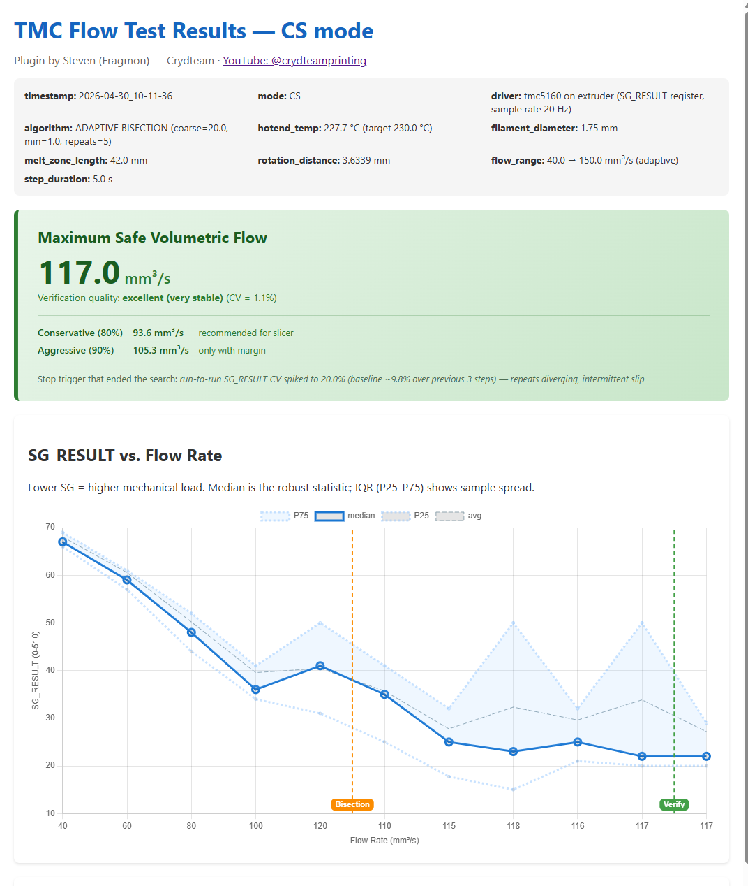

# TMC Flow Test
**Adaptive max-volumetric-flow detection for 3D printer extruders using TMC StallGuard.**

Find your extruder's real max flow rate automatically — no test prints, no measuring melted noodles.

[](https://www.gnu.org/licenses/gpl-3.0)
[](https://www.klipper3d.org/)

Plugin by **Steven (Fragmon) — Crydteam**
[](https://www.youtube.com/@crydteamprinting)

<p align="center">
  
</p>

---

## What it does

The plugin reads the TMC driver's **StallGuard** load signal during extrusion to detect when the motor is approaching slip. It runs a three-phase test:

1. **Coarse sweep** — flow rises in big steps until StallGuard sees the limit approach
2. **Bisection** — the safe value is narrowed to ±1 mm³/s; borderline measurements are auto-re-tested
3. **Verification** — final value is confirmed with extra repeats and a stability metric; if verify fails, the test drops back into bisection with a tighter bracket

Output: a CSV with raw data and an interactive HTML report with a **decision trail** (every trigger that fired, why, and which value defined the result).

---

## Quick start

1. **Install** (one-liner):
   ```bash
   cd ~/klipper/klippy/extras && \
   wget -O tmc_flow_test.py https://raw.githubusercontent.com/Fragmon/tmc_flow_test/main/tmc_flow_test.py
   ```
2. **Configure** your `[tmcXXXX extruder]` and add a `[tmc_flow_test]` section (see [Configuration](#configuration) below).
3. `FIRMWARE_RESTART`.
4. **Heat your hotend** to printing temperature, load filament.
5. Run:
   ```
   TMC_FLOW_FIND_MAX MAX=150 START=20
   ```

Test takes ~10 minutes (+30–60 s if borderline measurements need re-testing). CSV and HTML report land in `~/printer_data/config/Flowtest/`.

---

## Before you run: SG range check

The plugin only works well when StallGuard produces a **usable signal range**. Run the test once and watch the SG values printed in the Klipper console.

| Driver | Sensitivity field | Healthy SG range across the sweep |
|---|---|---|
| TMC2240 (SG4) | `driver_sg4_thrs` | low load: ~300–500, near slip: ~50–150 |
| TMC2209 (SG4) | `driver_SGTHRS` | similar to TMC2240 |
| TMC5160 / 2130 (SG2) | `driver_SGT` | low load: ~400–600, near slip: ~50–150 |

You want **at least 200 raw SG units** of dynamic range between low-load and high-load, with neither end saturated (0 or 1023).

**SG too low** (median <50, often saturating at 0):
- TMC5160: raise `driver_SGT` (e.g. +5 to +10)
- TMC2240/2209: lower `driver_sg4_thrs` / `driver_SGTHRS` (e.g. by 20)

**SG too high** (often saturating at 1023):
- Opposite of above.

A tested reference for **TMC5160 + Sherpa Mini**: `driver_SGT: 15` gives SG ≈ 540 at low flow, ≈ 90 near slip.

---

## Configuration

### TMC driver section

Pick the variant matching your driver. **Run the test with the same chopper-mode and current you use for printing.**

> ⚠️ Lines marked `# ADAPT` depend on your hardware. The other lines are required by the plugin.

#### TMC5160 (and TMC2130 / TMC2660)

```ini
[tmc5160 extruder]
cs_pin: PA15                     # ADAPT
spi_bus: spi4                    # ADAPT
run_current: 0.85                # ADAPT
hold_current: 0.6                # ADAPT
sense_resistor: 0.075            # ADAPT
interpolate: false
# DO NOT add stealthchop_threshold — see "Chopper mode" notes below
coolstep_threshold: 0.5
driver_SGT: 15                   # SG2 sensitivity, signed -64..63 (higher = less sensitive)
driver_SFILT: True               # SG2 filter (recommended for extruders)
driver_SEMIN: 2                  # CoolStep — set to 0 to disable
driver_SEMAX: 4
driver_SEUP: 3
driver_SEDN: 1
driver_SEIMIN: 1
```

#### TMC2240

```ini
[tmc2240 extruder]
cs_pin: PA15                     # ADAPT
spi_bus: spi4                    # ADAPT
rref: 12300                      # ADAPT
run_current: 0.85                # ADAPT
hold_current: 0.6                # ADAPT
interpolate: false
stealthchop_threshold: 999999    # required if using SG4 path
coolstep_threshold: 0.5
driver_sg4_thrs: 80              # SG4 sensitivity (0-255, higher = more sensitive)
driver_sg4_filt_en: True
driver_SEMIN: 5                  # CoolStep — set to 0 to disable
driver_SEMAX: 2
driver_SEUP: 2
driver_SEDN: 1
driver_SEIMIN: 1
```

#### TMC2209

```ini
[tmc2209 extruder]
uart_pin: PB12                   # ADAPT
run_current: 0.85                # ADAPT
hold_current: 0.6                # ADAPT
sense_resistor: 0.110            # ADAPT
interpolate: false
stealthchop_threshold: 999999
coolstep_threshold: 0.5
driver_SGTHRS: 100               # SG4 sensitivity (0-255, higher = more sensitive)
driver_SEMIN: 5                  # CoolStep — set to 0 to disable
driver_SEMAX: 2
driver_SEUP: 2
driver_SEDN: 1
driver_SEIMIN: 1
```

### Plugin section

```ini
[tmc_flow_test]
extruder_stepper: extruder       # ADAPT: stepper section name
filament_diameter: 1.75          # ADAPT: 1.75 or 2.85
melt_zone_length: 42             # ADAPT: hotend melt-zone length (Sherpa Mini ~42, V6 ~12, Volcano ~21)

# Optional:
#min_hotend_temp: 180            # safety floor, default 180
#output_dir: ~/printer_data/config/Flowtest
```

---

## Chopper mode (important for SG4 drivers)

Each TMC chip family supports StallGuard only in one specific chopper mode:

| Driver | StallGuard variant | Required mode |
|---|---|---|
| TMC2209 | SG4 | StealthChop (`stealthchop_threshold: 999999`) |
| TMC2240 | SG4 *(default)* or SG2 | StealthChop for SG4, SpreadCycle (`sg4_thrs: 0`) for SG2 |
| TMC5160 / 2130 / 2660 | SG2 | SpreadCycle (Klipper default — **don't add `stealthchop_threshold`**) |

> **`stealthchop_threshold: 0` is NOT the same as "no line".** It enables StealthChop with threshold 0, which breaks SG2. For SG2 drivers, **remove the line entirely**.

If you're not sure what mode you're in, run `TMC_FLOW_STATUS` — the plugin checks the configuration and tells you what's wrong. Or `DUMP_TMC STEPPER=extruder` and check `en_pwm_mode` (1 = StealthChop) and `tpwmthrs` (1048575 = pure SpreadCycle).

---

## How it works

The plugin samples StallGuard at 20 Hz during each measurement step (5 repeats by default) and tracks median, IQR (P25-P75), and run-to-run CV per step. Slip detection uses **14 independent triggers** that look for different signatures:

- **SG signal patterns** — snap-back, over-jump, plateau
- **Run-to-run variance** — CV spike, CV jump, rising trend, vs coarse-baseline
- **Sample distribution** — IQR widening, IQR vs coarse-baseline, IQR absolute
- **CoolStep-specific** — CS pegged + SG drop, CS pegged + CV spike, CS hard drop
- **Per-run analysis** — single-run outlier detection, SG max spike for decoupling

Each trigger fires under tighter conditions in **bisection / verify** than in coarse, so the coarse phase stays noise-resistant while the final result is accurate to ±1 mm³/s.

The HTML report's **decision-trail panel** lists every trigger event with the metrics that caused it, so you can see exactly why the plugin chose the value it did.

---

## Commands

### `TMC_FLOW_FIND_MAX`

Auto-detect mode (SG-only or CoolStep) from `driver_SEMIN` and run the full three-phase test.

| Parameter | Default | Description |
|---|---|---|
| `START` | 10 | Starting flow (mm³/s) |
| `MAX` | 80 | Upper search bound |
| `STEP` | 10 | Coarse sweep step size |
| `MIN_STEP` | 1 | Bisection precision |
| `DURATION` | 5 | Seconds per measurement |
| `REPEAT` | 5 | Repetitions per measurement |
| `VERIFY_REPEATS` | 5 | Repetitions in the verify phase |
| `COOLDOWN` | 15 | Pause between phases (seconds) |
| `TEMP` | hotend target | Override temperature |
| `MODE` | auto | `auto`, `sg`, or `cs` |
| `NO_HTML` | 0 | Set 1 to skip HTML report |

### `TMC_FLOW_STATUS`

Diagnostic check: verifies driver, chopper mode, StallGuard threshold, CoolStep config. **Run this before the first test.**

### Convenience aliases

`TMC_FLOW_FIND_MAX_SG` and `TMC_FLOW_FIND_MAX_CS` force the respective mode.

---

## Examples

```
# Standard test, fast extruders
TMC_FLOW_FIND_MAX MAX=150 START=20

# Quicker, less accurate
TMC_FLOW_FIND_MAX REPEAT=3 VERIFY_REPEATS=3 COOLDOWN=10

# More accurate (longer)
TMC_FLOW_FIND_MAX REPEAT=10 DURATION=8 VERIFY_REPEATS=10

# Diagnostic check
TMC_FLOW_STATUS
```

---

## Output

Files saved to `~/printer_data/config/Flowtest/`:

```
tmc_flow_<mode>_YYYY-MM-DD_HH-MM-SS.csv     ← raw data
tmc_flow_<mode>_YYYY-MM-DD_HH-MM-SS.html    ← interactive report
```

The HTML report includes:
- **Result panel** — max safe flow, slicer recommendations (80 % / 90 %)
- **Decision trail** — every trigger event with the "healthy ranges" that defined what was considered normal
- **SG vs flow chart** with median + IQR, phase markers, and trigger annotations marking exactly where slip was detected
- **CS_ACTUAL chart** (CoolStep mode)
- **TMC settings snapshot** at test start (collapsible) for reproducible documentation

The CSV header includes the same TMC settings block for paper-trail purposes.

---

## Troubleshooting

**`TMC_FLOW_STATUS` reports "StealthChop not active"** *(SG4 drivers only)* —
Add `stealthchop_threshold: 999999` to your TMC section, `FIRMWARE_RESTART`.

**`TMC_FLOW_STATUS` reports "StallGuard2 needs SpreadCycle"** *(SG2 drivers only)* —
Remove the `stealthchop_threshold:` line entirely from your TMC section, `FIRMWARE_RESTART`.

**`TMC_FLOW_STATUS` reports "sg4_thrs is 0" / "SGTHRS is 0"** —
Add `driver_sg4_thrs: 80` (TMC2240) or `driver_SGTHRS: 100` (TMC2209) to your TMC section.

**SG values too low / saturate at 0** —
Sensitivity is too high. Raise `driver_SGT` (TMC5160) or lower `driver_sg4_thrs` / `driver_SGTHRS` (TMC2240/2209).

**SG values too high / saturate at 1023** —
Sensitivity is too low. Opposite of above.

**`CS_ACTUAL` stays pinned at 31** *(CS mode only)* —
SEMIN is too high for your motor's SG range. Common on TMC5160 with `SEMIN: 5` copied from XY-stepper templates. The plugin handles this automatically (falls back to SG triggers and prints a recommended SEMIN at the end). Per Trinamic AN-002, `SEMIN ≈ SG_MAX/4..SG_MAX/8` — for typical extruder SG_MAX of 60–80, try `driver_SEMIN: 2`.

**Test reaches MAX without trigger** —
Either your hotend really can flow that fast (raise MAX), or SG sensitivity is too low (see "SG too high" above).

**Trigger fires immediately at START** —
SG sensitivity is too high (see "SG too low"), or your hotend isn't fully heated.

**Result varies between runs by more than 5 mm³/s** —
Check filament consistency, hotend temperature stability, possible filament path obstructions. Increase `COOLDOWN` between phases (e.g. 30 s).

---

## How is this different from a flow tower print?

| Flow tower print | TMC Flow Test |
|---|---|
| Visually inspect for under-extrusion | Reads motor's actual load signal |
| Subjective threshold | Objective StallGuard data |
| Wastes filament + ~1 hour | No filament wasted, ~10 minutes |
| One value per test | Full statistical profile + decision trail |
| Tells you when extrusion *looks* bad | Tells you when the *motor is starting to slip* |

Both methods measure different things — the motor can slip before extrusion looks bad (under-extrusion), or extrusion can look bad before the motor slips (cooling / pressure issues). For maximum-flow tuning where torque is the limit, this plugin is the more direct measurement.

---

## Credits & License

Released under the **GNU GPL v3.0**. See [LICENSE](LICENSE).

Inspired by Klipper's StallGuard implementation and [klipper_tmc_autotune](https://github.com/andrewmcgr/klipper_tmc_autotune).

Plugin author: **Steven (Fragmon) — Crydteam** · [YouTube: @crydteamprinting](https://www.youtube.com/@crydteamprinting)

Contributions and feedback welcome — please open an issue or PR.
